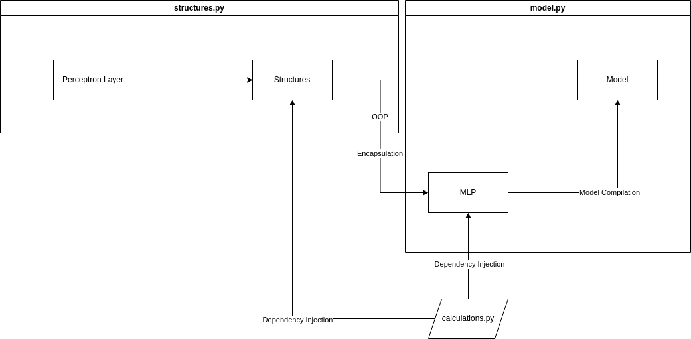

# Py-MLP

## Main Code Description

This code is based mainly on the ideas of Object-Oriented-Programming (OOP), and naturally tries to lead to a more abstract code structure. It utilizes concepts such as encapsulation and dependency injection to facilitate readability.

The *model* module is an attempt to not create trade-offs between readability and performance. As simple as it gets, it offers diffent classes to represent the same object, for the exception that the Model class is actually functional and structured in a performance-guided way (using numpy and slightly denser functionalities). The MLP model instantiates a functional Model object.

**Used Modules: Pandas, Numpy**
## Hierarchy and Architecture

The hierarchy of this project's architecture can be visualized as follows:

